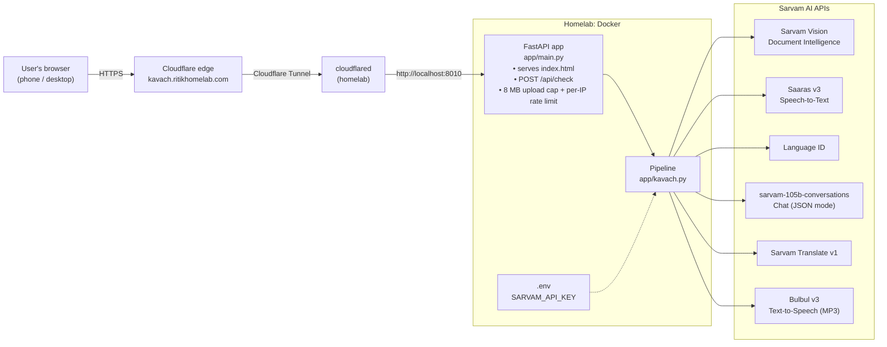
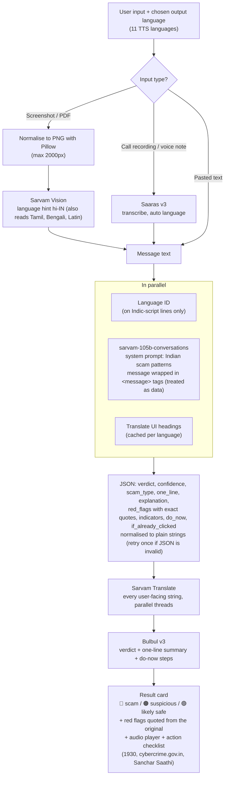

# Scam Kavach architecture

## Deployment

```mermaid
flowchart LR
    U["User's browser<br/>(phone / desktop)"] -->|HTTPS| CF["Cloudflare edge<br/>kavach.ritikhomelab.com"]
    CF -->|Cloudflare Tunnel| CFD["cloudflared<br/>(homelab)"]
    CFD -->|"http://localhost:8010"| APP

    subgraph Homelab["Homelab: Docker"]
        APP["FastAPI app<br/>app/main.py<br/>• serves index.html<br/>• POST /api/check<br/>• 8 MB upload cap + per-IP rate limit"]
        PIPE["Pipeline<br/>app/kavach.py"]
        ENV[".env<br/>SARVAM_API_KEY"]
        APP --> PIPE
        ENV -.-> PIPE
    end

    subgraph Sarvam["Sarvam AI APIs"]
        V["Sarvam Vision<br/>Document Intelligence"]
        S["Saaras v3<br/>Speech-to-Text"]
        L["Language ID"]
        C["sarvam-105b-conversations<br/>Chat (JSON mode)"]
        T["Sarvam Translate v1"]
        B["Bulbul v3<br/>Text-to-Speech (MP3)"]
    end

    PIPE --> V & S & L & C & T & B
```

## Request flow

```mermaid
flowchart TD
    IN["User input + chosen output language<br/>(11 TTS languages)"] --> K{Input type?}

    K -->|Screenshot / PDF| IMG["Normalise to PNG with Pillow<br/>(max 2000px)"]
    IMG --> V1["Sarvam Vision<br/>language hint hi-IN (also reads Tamil, Bengali, Latin)"] --> MSG
    K -->|Call recording / voice note| STT["Saaras v3<br/>transcribe, auto language"] --> MSG
    K -->|Pasted text| MSG

    MSG["Message text"] --> PAR
    subgraph PAR["In parallel"]
        LID["Language ID<br/>(on Indic-script lines only)"]
        LLM["sarvam-105b-conversations<br/>system prompt: Indian scam patterns<br/>message wrapped in &lt;message&gt; tags (treated as data)"]
        HEAD["Translate UI headings<br/>(cached per language)"]
    end
    PAR --> NORM["JSON: verdict, confidence, scam_type, one_line, explanation,<br/>red_flags with exact quotes, indicators, do_now, if_already_clicked<br/>normalised to plain strings (retry once if JSON is invalid)"]
    NORM --> TR["Sarvam Translate<br/>every user-facing string, parallel threads"]
    TR --> TTS["Bulbul v3<br/>verdict + one-line summary + do-now steps"]
    TTS --> OUT["Result card<br/>🔴 scam / 🟠 suspicious / 🟢 likely safe<br/>+ red flags quoted from the original<br/>+ audio player + action checklist<br/>(1930, cybercrime.gov.in, Sanchar Saathi)"]
```
